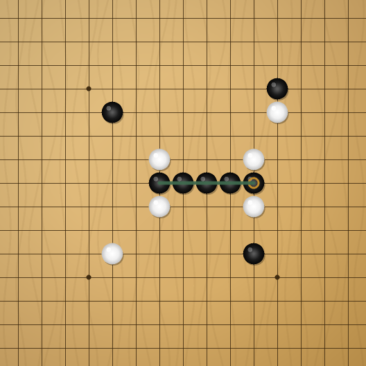
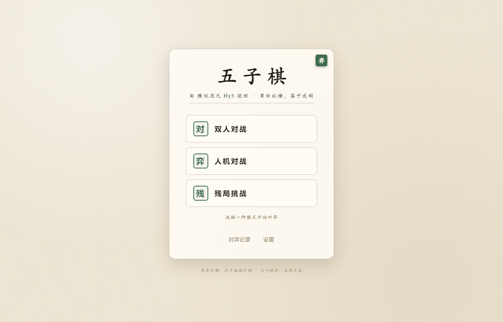

# 五子棋 · Hy3

一个用 **腾讯混元 Hy3** 驱动的五子棋网页游戏，规则与玩法 1:1 复刻自原作者基于 Qt/C++ 的桌面五子棋（[gitee 原项目](https://gitee.com/chenyuxinwtt/qt-wuziqi-master)），并把 AI 换成了 Hy3。

> 纯前端、零依赖：页面本身零 npm 依赖、无需构建；调真 Hy3 时额外用一个 Python 标准库写的本地代理 `serve.py`（可选，仅用于绕过浏览器 CORS）。没 API Key 也能玩——此时 AI 自动切换为**忠实移植自原版的评分引擎**（无需联网），配真实 Key 则交由 Hy3 实时推理对弈。

棋盘与棋子全部由单个 `<canvas>` 采用 `PAD + i*CELL` 同一坐标公式绘制（网格线、星位、落子、胜利连线共用一套坐标），**棋子精确落在交叉点上**；木纹底、立体棋子（投影+径向渐变+高光）均在 Canvas 内绘制。


_上图为用与页面完全相同的绘制逻辑栅格化出的真实位图（非示意图），可放大核对落子对齐。_


_主菜单界面（真实截图）。_

## 演示视频（≤1 分钟）

[📺 在线观看](assets/demo.mp4) | [⬇ 直接下载](https://github.com/L-85/hy3-gomoku/raw/main/assets/demo.mp4)

（人机对战 · 中级，约 52 秒，展示落子、黑白交替与 Hy3 思考面板）

> 若 GitHub 网页预览无法加载，请使用「直接下载」链接，或右键另存为下载到本地播放。

## Hy3 在系统里承担什么角色

- **AI 对手（人机对战 / 残局挑战）**：每轮把当前棋盘状态与落子历史发给 Hy3，让它分析局势、识别威胁（活三/活四/冲四）、选择最佳落子位置，返回 JSON `{row, col, reasoning}`。
- **推理过程展示**：Hy3 的落子推理会流式展示在「思考面板」里（含 JSON 中的 `reasoning` 思考文字），你能看到它为什么走这一步。
- **复盘分析**：对局结束后，胜负弹窗会展示 Hy3 的复盘文字。
- **本地兜底 AI**：无 Key 时，使用从原 QT 项目移植的全局评分表引擎（8 方向扫描 + 攻防加权 + 三级难度），保证离线也能正常对弈。

## 功能（复刻原版）

| 模式 | 说明 |
|------|------|
| ⚔ 双人对战 | 同屏两人轮流落子，黑棋先行 |
| 🤖 人机对战 | 可选**先后手**（执黑先手 / 执白后手，AI 先走天元），三级难度 |
| 🧩 残局挑战 | 8 关单人解题，你执白限定步数内连成五子，AI 自动拦截 |

**辅助操作**：悔棋、重新开始、认输、返回菜单；对弈记录（localStorage 留存，**支持单条删除**）；键盘快捷键 `Esc` 返回 / `R` 重开 / `Ctrl+Z` 悔棋；侧栏**题诗**水墨点缀（复刻原版诗句）。

**AI 评分引擎（本地兜底）三级难度**：

| 难度 | 防守系数 | 进攻系数 | 棋风 |
|------|:---:|:---:|------|
| 初级 | ×1.3 | ×0.6 | 保守防守 |
| 中级 | ×1.0 | ×1.0 | 攻守均衡 |
| 高级 | ×0.7 | ×1.5 | 激进进攻 |

## 快速开始（推荐：本地代理跑真 Hy3）

```bash
cd hy3-gomoku
python serve.py          # 启动同源代理 + 静态服务，默认 http://127.0.0.1:8080
# 浏览器访问 http://localhost:8080/
```

> **为什么需要 `serve.py`？** 腾讯云 TokenHub / SiliconFlow / Novita 等 OpenAI 兼容端点**不返回浏览器跨域（CORS）头**，纯前端直连会被浏览器拦截、自动回退到本地 AI。
> `serve.py` 在本机同源（`127.0.0.1:8080`）托管页面并把 `/v1/*` 反向代理到 TokenHub、补上 CORS 头，真实 Hy3 才能被调到。Key 始终只在前端、代理仅做转发，不存储任何密钥。
> 端口可在环境变量覆盖：`PORT=9000 python serve.py`。

打开后：

1. **不填 Key** → 本地 AI 兜底：点「人机对战」→ 选先后手（执黑先手 / 执白后手）→ 点棋盘落子，思考面板展示本地引擎的合成分析。
2. **填 Key（真 Hy3）** → 点右上「设置」，接入方选「本地代理（serve.py）」（默认），填入腾讯云 TokenHub 的 API Key（model 固定 `hy3`）。保存后即可与真 Hy3 对弈，思考面板实时展示其落子推理过程。Key 只存浏览器 localStorage，不上传。

> 临时纯静态预览（无代理、直连会触发 CORS 回退本地 AI）：`python -m http.server 8000` 然后开 `http://localhost:8000`。

## 申请 Hy3 API Key（腾讯云 TokenHub，国内首选）

1. 打开 [腾讯云 TokenHub 控制台](https://console.cloud.tencent.com/tokenhub/apikey)（需腾讯云账号，实名后通常送 50–100 万免费 tokens）。
2. 新建 API Key 并复制保存（仅显示一次）。
3. 在五子棋「设置」里粘贴该 Key，接入方选「本地代理（serve.py）」即可。
4. 端点与模型：`https://tokenhub.tencentmaas.com/v1` · `model=hy3`。

> 国际站也可用 SiliconFlow（`https://api.siliconflow.com/v1` / `tencent/Hy3`），但国内访问不稳定，且同样需经 `serve.py` 代理规避 CORS。

## 录 demo 视频（≤1 分钟）

**录真 Hy3 出镜（推荐）**：

1. 起代理：`python serve.py`，开 `http://localhost:8080/`
2. 设置里填 TokenHub Key，接入方「本地代理（serve.py）」
3. 选「人机对战 · 中级」落子对弈，让思考面板露出 Hy3 推理流
4. 系统录屏（Win：`Win+G`；Mac：QuickTime）录 30–60 秒，导出 mp4

**仅录本地 AI（无需联网）**：

1. `python -m http.server 8000`，开 `http://localhost:8000`
2. 选「人机对战 · 中级」或「残局挑战」第 1 关一步制胜，录屏导出

## 目录结构

```
hy3-gomoku/
├── index.html        # 页面结构（菜单 / 游戏 / 各弹窗）
├── styles.css        # 新中式水墨风样式（木纹棋盘、3D 棋子、毛玻璃卡片）
├── app.js            # 主逻辑：棋盘 / 落子 / 胜负判定 / 评分引擎兜底 / Hy3 流式调用 / 残局 / 记录
├── challenges.js     # 残局题库（移植自原版 8 关）
├── serve.py          # 本地同源代理（绕过 CORS，调用真 Hy3）
├── assets/
│   ├── board-proof.png  # 真实渲染图（与页面同逻辑栅格化）
│   ├── demo.mp4         # 演示视频（≤1 分钟）
│   └── preview.png      # 主菜单真实截图
├── LICENSE          # Apache 2.0
├── .gitignore
└── README.md
```

## 与原版的关系

- **规则一致**：15×15、五子连珠、黑先、和棋判定，与原 Qt 版完全相同。
- **AI 替换**：原版用 C++ 评分表引擎做 AI；本网页版把 AI 角色交给 Hy3，同时把原评分引擎移植为「无 Key 兜底」（保证离线可玩），算法与三级难度权重 1:1 对应。
- **新增**：Hy3 推理过程流式展示、复盘分析、Web 音效、对弈记录本地留存（含单条删除）、先后手选择、题诗点缀、键盘快捷键。

- **还原原版特征**：人机对战可选择先后手（执白后手时 Hy3 先占天元）、侧栏题诗、键盘快捷键、对弈记录单条删除，视觉采用新中式水墨风（行书标题、木纹棋盘、径向渐变棋子、胜利连线）。

## 开源协议

原版 MIT（仅供学习交流）。本网页版沿用 Apache 2.0（与 Hy3 一致）。

## 致谢

- 模型：腾讯混元 Hy3（[Tencent-Hunyuan/Hy3](https://github.com/Tencent-Hunyuan/Hy3)）
- 原桌面版：[gitee.com/chenyuxinwtt/qt-wuziqi-master](https://gitee.com/chenyuxinwtt/qt-wuziqi-master)
- 本作品为腾讯犀牛鸟 2026 开源人才培养计划实战 Issue 产出。
