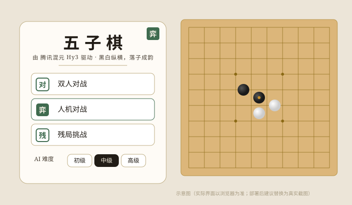

# 五子棋 · Hy3

一个用 **腾讯混元 Hy3** 驱动的五子棋网页游戏，规则与玩法 1:1 复刻自原作者基于 Qt/C++ 的桌面五子棋（[gitee 原项目](https://gitee.com/chenyuxinwtt/qt-wuziqi-master)），并把 AI 换成了 Hy3。

> 纯前端、零依赖、零后端。没 API Key 也能玩——此时 AI 自动切换为**忠实移植自原版的评分引擎**（无需联网），配真实 Key 则交由 Hy3 实时推理对弈。

棋盘与棋子全部由单个 `<canvas>` 采用 `PAD + i*CELL` 同一坐标公式绘制（网格线、星位、落子、胜利连线共用一套坐标），**棋子精确落在交叉点上**；木纹底、立体棋子（投影+径向渐变+高光）均在 Canvas 内绘制。


_上图为用与页面完全相同的绘制逻辑栅格化出的真实位图（非示意图），可放大核对落子对齐。_


_主菜单与对弈界面（水墨风示意图）。_

## 演示视频（≤1 分钟）

[点击观看演示视频](assets/demo.mp4)（人机对战 · 中级，展示落子、黑白交替与 Hy3 思考面板）

> 视频文件放在仓库根目录的 `assets/demo.mp4`（或 `demo.gif`）。

## Hy3 在系统里承担什么角色

- **AI 对手（人机对战 / 残局挑战）**：每轮把当前棋盘状态与落子历史发给 Hy3，让它分析局势、识别威胁（活三/活四/冲四）、选择最佳落子位置，返回 JSON `{row, col, reasoning}`。
- **推理过程展示**：Hy3 的 `reasoning_content` 思考链会流式展示在「思考面板」里，你能看到它为什么走这一步。
- **复盘分析**：对局结束后，胜负弹窗会展示 Hy3 的复盘文字。
- **本地兜底 AI**：无 Key 时，使用从原 QT 项目移植的全局评分表引擎（8 方向扫描 + 攻防加权 + 三级难度），保证离线也能正常对弈。

## 功能（复刻原版）

| 模式 | 说明 |
|------|------|
| ⚔ 双人对战 | 同屏两人轮流落子，黑棋先行 |
| 🤖 人机对战 | 可选**先后手**（执黑先手 / 执白后手，AI 先走天元），三级难度 |
| 🧩 残局挑战 | 8 关单人解题，你执白限定步数内连成五子，AI 自动拦截 |

**辅助操作**：悔棋、重新开始、认输、返回菜单；对弈记录（localStorage 留存，**支持单条删除**）；键盘快捷键 `Esc` 返回 / `R` 重开 / `Ctrl+Z` 悔棋；侧栏**题诗**水墨点缀（复刻原版诗句）。

**AI 评分引擎（本地兜底）三级难度**：

| 难度 | 防守系数 | 进攻系数 | 棋风 |
|------|:---:|:---:|------|
| 初级 | ×1.3 | ×0.6 | 保守防守 |
| 中级 | ×1.0 | ×1.0 | 攻守均衡 |
| 高级 | ×0.7 | ×1.5 | 激进进攻 |

## 快速开始

```bash
cd hy3-tiling
python -m http.server 8000
# 浏览器访问 http://localhost:8000
```

打开后：

1. **不填 Key** → 本地 AI 兜底：点「人机对战」→ 选先后手（执黑先手 / 执白后手）→ 点棋盘落子，思考面板展示本地引擎的合成分析。
2. **填 Key** → 真实 Hy3 对弈：点右上「设置」，选 SiliconFlow（`https://api.siliconflow.com/v1` / `tencent/Hy3`）或 Novita，填入 Key。Key 只存浏览器 localStorage，不上传。

## 录 demo 视频（≤1 分钟）

1. 本地起服务：`python -m http.server 8000`
2. 浏览器开 `http://localhost:8000`
3. 用系统录屏（Win：`Win+G`；Mac：QuickTime）录 30–60 秒：
   - **推荐（无需联网）**：选「人机对战 · 中级」→ 点棋盘落子 → 看黑白交替 + 思考面板 → 终局弹窗
   - 或选「残局挑战」第 1 关「一步制胜」，演示一步取胜
4. 导出为 mp4 或 GIF。

## 目录结构

```
hy3-tiling/
├── index.html        # 页面结构（菜单 / 游戏 / 各弹窗）
├── styles.css        # 新中式水墨风样式（木纹棋盘、3D 棋子、毛玻璃卡片）
├── app.js            # 主逻辑：棋盘 / 落子 / 胜负判定 / 评分引擎兜底 / Hy3 流式调用 / 残局 / 记录
├── challenges.js     # 残局题库（移植自原版 8 关）
├── assets/
│   ├── board-proof.png  # 真实渲染图（与页面同逻辑栅格化）
│   └── preview.svg      # 界面预览示意图
├── LICENSE          # Apache 2.0
├── .gitignore
└── README.md
```

## 与原版的关系

- **规则一致**：15×15、五子连珠、黑先、和棋判定，与原 Qt 版完全相同。
- **AI 替换**：原版用 C++ 评分表引擎做 AI；本网页版把 AI 角色交给 Hy3，同时把原评分引擎移植为「无 Key 兜底」（保证离线可玩），算法与三级难度权重 1:1 对应。
- **新增**：Hy3 推理过程流式展示、复盘分析、Web 音效、对弈记录本地留存（含单条删除）、先后手选择、题诗点缀、键盘快捷键。

- **还原原版特征**：人机对战可选择先后手（执白后手时 Hy3 先占天元）、侧栏题诗、键盘快捷键、对弈记录单条删除，视觉采用新中式水墨风（行书标题、木纹棋盘、径向渐变棋子、胜利连线）。

## 与 CodeBuddy / WorkBuddy 的协作

本项目开发过程中使用了 AI 编程工具辅助：

- `app.js` 的 SSE 流式解析、评分引擎移植、胜负判定
- `challenges.js` 的残局数据从原 C++ 移植
- 本 README 初稿

其余界面设计、产品构思与联调均为人工完成。

## 开源协议

原版 MIT（仅供学习交流）。本网页版沿用 Apache 2.0（与 Hy3 一致）。

## 致谢

- 模型：腾讯混元 Hy3（[Tencent-Hunyuan/Hy3](https://github.com/Tencent-Hunyuan/Hy3)）
- 原桌面版：[gitee.com/chenyuxinwtt/qt-wuziqi-master](https://gitee.com/chenyuxinwtt/qt-wuziqi-master)
- 本作品为腾讯犀牛鸟 2026 开源人才培养计划实战 Issue 产出。
